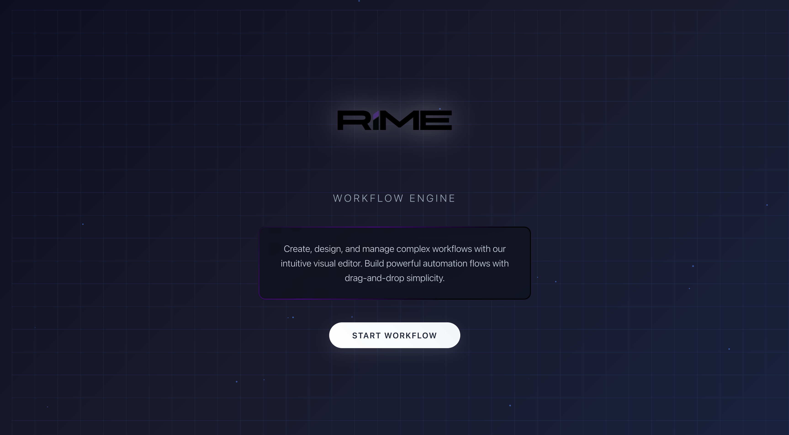
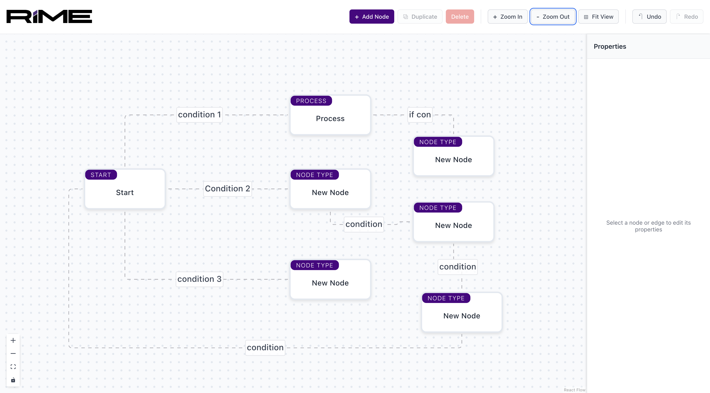
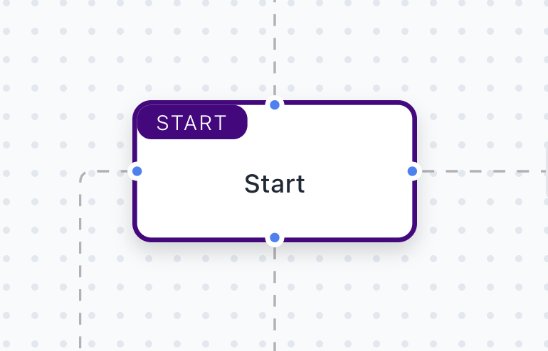
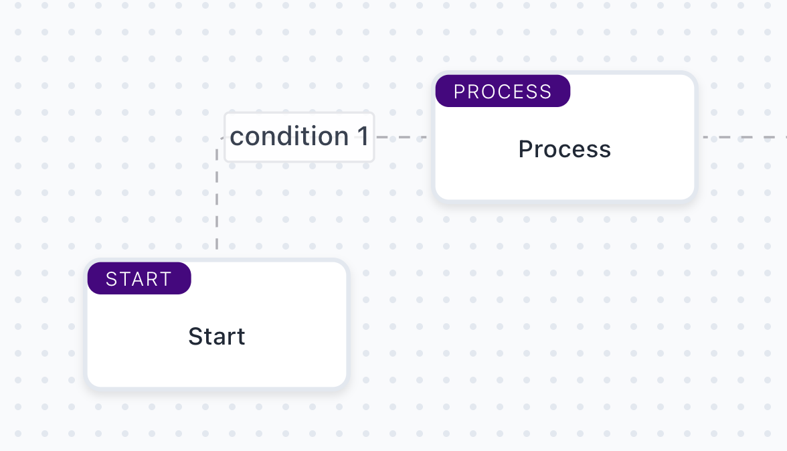
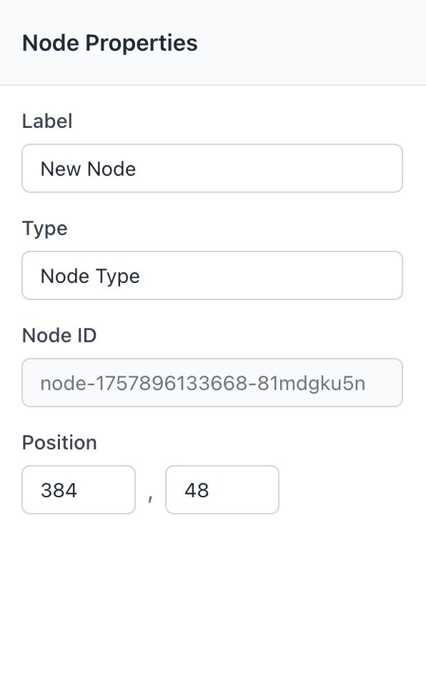
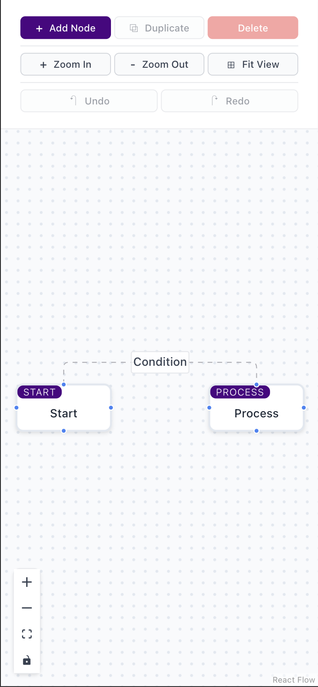

# RIME Workflow Engine

A powerful, intuitive visual workflow editor built with React, TypeScript, and React Flow. Create, design, and manage complex workflows with drag-and-drop simplicity.


## 🚀 Features

### 🎨 **Modern Landing Page**
- **Futuristic Design**: Dark theme with animated background and floating particles
- **Brand Integration**: Custom logo with neon border effects
- **Responsive Layout**: Optimized for all devices from mobile to desktop
- **Smooth Animations**: Elegant transitions and loading effects



### 🖼️ **Visual Workflow Canvas**
- **React Flow Integration**: Professional node-based editor
- **Pan & Zoom**: Smooth navigation with mouse and touch support
- **Snap to Grid**: Precise node positioning with 12px grid
- **Background Grid**: Visual guide for alignment



### 🔗 **Smart Node System**
- **Custom Nodes**: Workflow-specific node types with labels and types
- **Four-Side Connections**: Connect from any side (top, right, bottom, left)
- **Flexible Handles**: Both source and target handles on each side
- **Mobile Optimized**: Larger touch targets for mobile devices
- **Visual Feedback**: Hover effects and connection highlights



### 🔄 **Advanced Edge Management**
- **Conditional Edges**: Add custom conditions to connections
- **Multiple Connections**: Allow multiple edges between same nodes with different conditions
- **Smart Validation**: Prevent invalid connections (no self-loops)
- **Animated Edges**: Smooth, animated connections
- **Edge Labels**: Display conditions along the edge path



### ⚙️ **Properties Panel**
- **Real-time Editing**: Edit node labels and types instantly
- **Edge Conditions**: Modify connection conditions on the fly
- **Responsive Design**: 
  - Desktop: Always visible sidebar
  - Mobile: Compact bar under toolbar
- **Smart Fields**: Show only editable fields on mobile
- **Auto-save**: Changes applied immediately



### 🛠️ **Toolbar & Controls**
- **Add Node**: Quick node creation with toolbar button
- **Zoom Controls**: Zoom in, zoom out, fit to view
- **Undo/Redo**: Full history management (up to 20 actions)
- **Visual Controls**: React Flow's built-in navigation controls
- **Keyboard Shortcuts**: Power user shortcuts for efficiency


### ⌨️ **Keyboard Shortcuts**
- **Ctrl/Cmd + Z**: Undo last action
- **Ctrl/Cmd + Shift + Z**: Redo last undone action
- **Delete/Backspace**: Delete selected node or edge
- **Escape**: Clear selection
- **Double-click**: Add new node at cursor position

### 📱 **Mobile-First Design**
- **Touch Optimized**: Large touch targets and gestures
- **Responsive Layout**: Adapts to all screen sizes (320px+)
- **Mobile Handles**: Larger, always-visible connection points
- **Compact UI**: Streamlined interface for small screens
- **Status Bar**: Custom theme colors for iOS/Android



### 🎯 **User Experience**
- **Toast Notifications**: Success/error feedback with click-to-dismiss
- **Smooth Animations**: 60fps transitions and effects
- **Loading States**: Elegant loading animations
- **Error Handling**: Graceful error recovery
- **Accessibility**: Keyboard navigation and screen reader support

## 🛠️ **Technology Stack**

- **Frontend**: React 18 + TypeScript
- **State Management**: Zustand
- **Flow Editor**: React Flow (@xyflow/react)
- **Styling**: CSS Modules with responsive design
- **Build Tool**: Vite
- **Notifications**: React Toastify

## 📦 **Installation**

```bash
# Clone the repository
git clone https://github.com/bilaldadi/rime_Workflow.git
cd rime-workflow

# Install dependencies
npm install

# Start development server
npm run dev
```

## 🚀 **Usage**

### **Getting Started**
1. **Launch the app** - You'll see the futuristic landing page
2. **Click "Get started"** - Enter the workflow canvas
3. **Add nodes** - Use the toolbar button or double-click on canvas
4. **Connect nodes** - Drag from any node handle to another
5. **Edit properties** - Select nodes/edges to edit in the properties panel

### **Creating Workflows**
1. **Add Nodes**: Click the "Add Node" button or double-click on empty canvas
2. **Move Nodes**: Drag nodes to position them
3. **Connect Nodes**: Drag from any handle (blue dots) to another node
4. **Add Conditions**: Edit edge conditions in the properties panel
5. **Save Work**: Use undo/redo to manage your workflow history

### **Mobile Usage**
- **Touch to select** nodes and edges
- **Pinch to zoom** and pan around the canvas
- **Long press** for context menus (future feature)
- **Swipe** to navigate large workflows


## 📱 **Browser Support**

- **Chrome**: 90+
- **Firefox**: 88+
- **Safari**: 14+
- **Edge**: 90+
- **Mobile**: iOS 14+, Android 8+
